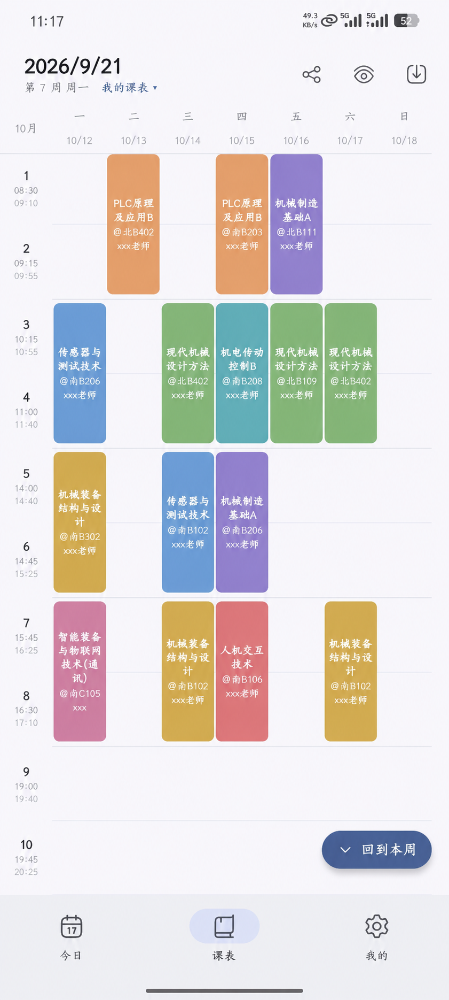
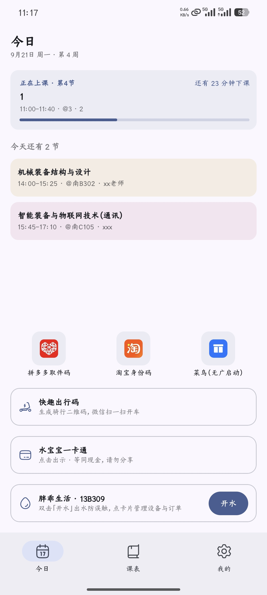

# 城职课表（GCP Schedule）

广州城市职业学院 · 正方教务的课表 Android App —— 学生自用，**非学校官方应用**（详见文末[免责声明](#免责声明)）。

## 下载安装

**➡️ [点这里下载最新版（Releases）](https://github.com/l1621662/gcp-schedule/releases/latest)**

- 系统要求：Android 8.0（API 26）及以上
- 下载到的文件名形如 `GCP-Schedule-x.y.z.apk`，是正式签名版；装好后在「我的 → 关于」可以看到版本号
- **正式版与测试版（Debug）是两个独立应用**：包名分别是 `edu.gcp.schedule` 与 `edu.gcp.schedule.debug`，可以同时安装，但**数据不互通**。
  如果你现在用的是 Debug 版、想换到正式版：先在 Debug 版「我的 → 课表数据 → 导出 JSON」，装正式版后再导入即可（成绩会随该 JSON 一起备份）
- 早期版本（原项目的「水贝贝」或更早的包名）与本 App 签名不同，**无法覆盖安装**：同样先导出 JSON → 卸载旧包 → 安装本 App → 导入

 

> 截图取自本项目早期版本；今日页已按本校情况裁剪（不再包含开水、骑行、校园卡入口）。

## 功能

**课表**

- 从正方教务一键导入学期课表：App 内填「学号 + 密码 + 验证码」（验证码图片直接取自教务登录页，点图片可刷新），不用在网页里手动翻找课表
- 今日课表 / 周课表、上课提醒、系统日历同步、调课规划（把某天的课调到另一天）
- **调课自动检测**（实验性，尚未充分测试）：定期比对教务课表与本地课表，发现调课 / 停课 / 换教室时先提示、你确认后再更新

**成绩**

- 一键导入全部学期成绩，按学期 / 学年分组，自动计算加权平均分与平均绩点

**桌面小组件**

- 单条目、尺寸自适应（紧凑 / 今日列表 / 本周网格）

**其它**

- 今日页快捷方式（取快递码等常用入口，可自行添加编辑）
- 课表、成绩等数据支持本地 JSON 导出与导入备份

## 使用

课表默认为空、不预置样例：

- 课表：**我的 → 教务导入** → 登录正方教务 → 从教务菜单进入课表查询页 → 点「导入课表」
- 成绩：**我的 → 成绩查询** → 页内「导入成绩」
- 调课自动检测：**我的 → 调课自动检测** → 填学号 / 密码 / 验证码后开启

> 考试安排导入尚未适配正方教务：入口保留，但点了会提示暂不可用。

---

# 开发

整体架构与实现说明见 **[DEVELOPER.md](DEVELOPER.md)**。

## 环境要求

| 项 | 要求 |
|----|------|
| JDK | 17+ |
| Android Studio | Koala / Ladybug 及以上 |
| Android SDK | Platform 35，Build-Tools 35.x |
| Gradle / Kotlin | Wrapper 8.10.2 / 2.1.21（已随仓库配置） |
| minSdk / targetSdk | 26 / 35 |
| applicationId | `edu.gcp.schedule`（debug 变体加 `.debug` 后缀，可与正式包共存） |

## 构建与测试

```bash
./gradlew.bat :app:testDebugUnitTest :app:assembleDebug
# APK: app/build/outputs/apk/debug/app-debug.apk
```

单测结果汇总在 `app/build/test-results/testDebugUnitTest/`。

## 工程结构

```
app/src/main/java/edu/gcp/schedule/
  MainActivity.kt           # 底部导航：今日 / 课表 / 我的
  SubpageActivity.kt        # 二级页容器（课表管理/设置/成绩/调课/提醒/小组件等）
  JwImportActivity.kt       # 教务 WebView 导入（课表 / 成绩）
  domain/                   # 纯逻辑层：Course / ScheduleCalculator 等，可 JVM 测
  data/local|repo|prefs|jw/ # Room 存储 · 仓库 · DataStore · 正方教务解析与无界面登录
  ui/today|week|me|score|widget|detect|…/  # Compose 界面按模块分包
DESIGN.md                   # UI 与领域模型规格（改导航 / 课表模型前必读）
DEVELOPER.md                # 架构与实现说明
```

## 参考

- 原项目 JUWP-Schedule：https://github.com/Inonvation/JUWP-Schedule （MIT）
- 拾光课程表：https://github.com/XingHeYuZhuan/shiguangschedule
- HugeIcons Compose：`com.github.rikkahub:hugeicons-compose`（JitPack）

## 来源与致谢

本项目**不是从零写的**，而是下面这个开源项目的改版：

- **本仓库**：https://github.com/l1621662/gcp-schedule
- **原项目**：[Inonvation/JUWP-Schedule](https://github.com/Inonvation/JUWP-Schedule)（MIT）——
  面向江西水利电力大学的课表 App；界面骨架、课表/成绩领域模型、小组件、调课检测框架等都来自它

**本改版主要改了什么**

1. 适用学校与教务系统：从「江西水利电力大学 · 强智教务」换成「广州城市职业学院 · 正方教务」，
   重写教务导入链路（WebView 注入 JS 解析课表/成绩）与调课检测链路（无界面登录 + 验证码 + 会话复用）
2. 删除原学校专属的第三方模块：胖乖生活（开水/余额/订单）、水宝宝一卡通（付款码/充值/流水）、
   快趣共享单车出码，以及只服务于强智系统的实验课表与解析器
3. 作息表按本校实际作息调整（第 7–11 节）
4. 应用名「城职课表」、包名 `edu.gcp.schedule`、新图标，以及配套文档与免责声明改写

**版权与许可**：原项目的版权归原作者所有；本改版同样以 MIT 许可发布，
原版权声明保留在 [LICENSE](LICENSE) 中，请勿移除。若你是原项目作者并希望调整署名方式，欢迎提 Issue 联系。

**AI 协作说明**：本改版的大部分代码、测试与文档是与 AI 助手协作完成的——**DeepSeek V4 Pro**（运行在 Codex 桌面端）。
具体包括：正方教务导入链路与调课检测（无界面登录 + 验证码）的实现与调试、原学校专属模块的裁剪、
作息表调整、构建与测试排错、README/免责声明/发版流程等文档；所有内容均由仓库作者 **l1621662** 审核、真机验证后提交，
作者对发布内容负责。

**AI 参与不改变责任归属**：AI 不承担任何使用后果，免责条款见下节。
**致谢**：感谢 Inonvation 开源 JUWP-Schedule；也感谢 [拾光课程表](https://github.com/XingHeYuZhuan/shiguangschedule)
在课表模型与 UI 思路上的参考价值。

## 免责声明

「城职课表」是学生个人开发的第三方工具，**非学校官方应用**，与广州城市职业学院及其教务处、信息中心等
任何部门均无隶属、合作或授权关系；文中出现的学校名称仅用于说明适用场景。

1. **数据来源**：App 仅在你本人登录教务系统后，读取你账号本就有权查看的课表、成绩等数据；
   不会向教务系统写入或修改任何内容，不代为选课、抢课，也不绕过任何身份验证
   （登录验证码必须由你本人输入）。
2. **账号与隐私**：学号、密码只保存在你本机（Android Keystore 加密存储），不进入云备份、
   不上传任何服务器、不写入日志。你可以随时关闭相关功能，关闭即清除已保存的凭证。
3. **数据准确性**：课表、成绩、考试安排与调课信息一律**以学校教务系统为准**。本 App 的展示、
   提醒与「调课检测」结果仅供参考，不作为选课、考试时间等正式依据；教务页面改版或接口变动
   可能导致功能失效或数据延迟。
4. **风险自负**：使用本 App 产生的一切后果（包括但不限于错过课程或考试、课表显示偏差、
   账号异常等）由使用者自行承担。
5. **使用边界**：禁止将本 App 用于刷分、绕过付费、伪造官方身份、攻击或爬取学校系统、
   售卖或商业牟利等用途。
6. **开源与许可**：本项目基于 [Inonvation/JUWP-Schedule](https://github.com/Inonvation/JUWP-Schedule)（MIT）
   修改而来，保留原项目的 MIT 许可与版权声明；本改版同样以 MIT 许可发布。
7. **无统计与广告**：App 不包含任何统计、广告 SDK，不收集也不分享你的个人信息；
   课表等数据仅保存在本机，导出文件由你自己保管。
8. **变更与终止**：本项目可能随时更新或停止维护，不承诺持续可用；如学校或相关方提出异议，
   将配合调整或下架。

有疑问或认为存在侵权，请通过仓库 Issues 联系。
